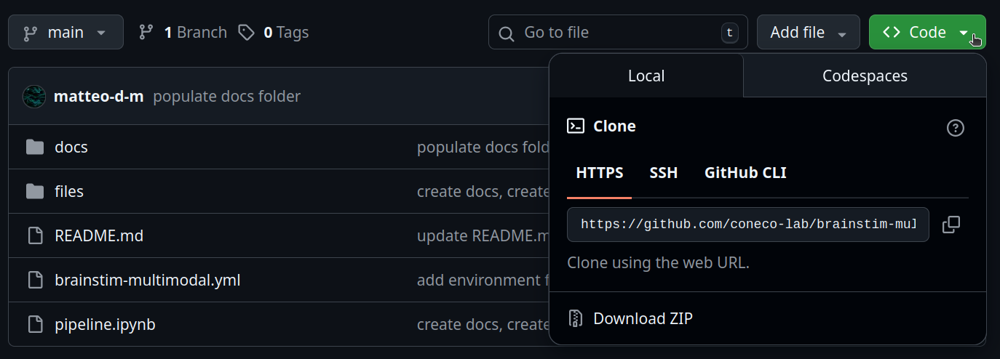

# **Brain Stimulation & Multimodal Electrophysiological Recording &mdash; Hands-on!**

This repository contains Python code for the hands-on TMS-EEG preprocessing activity offered as part of the [Brain Stimulation & Multimodal Electrophysiological Recording](https://unitn.coursecatalogue.cineca.it/insegnamenti/2025/50512_653501_96292/2011/50513/10168?annoOrdinamento=2011&coorte=2024) course, taught by prof. Carlo Miniussi and prof. Paolo Belardinelli at the [Master's Degree in Cognitive Science](https://corsi.unitn.it/en/cognitive-science), University of Trento (academic year 2025/2026).

The repository was created and is maintained by the course tutor [Matteo De Matola](https://webapps.unitn.it/du/en/Persona/PER0247884/Curriculum).

**Repository structure**

```bash
root/
├── docs/                      # text documents with supplementary materials & tutorials
├── files/                     # supplementary files (e.g., images)
├── scripts/                   # a full pipeline structured as Python scripts
├── README.md                  # the file you are reading, the information you need
├── brainstim-multimodal.yml   # installation file (see below)
└── pipeline.ipynb             # the actual Python code to use for the hands-on activity
```

## Jump to

- [General facts](#general-facts)
- [For the exam](#for-the-exam)
    - [Attendance rules for the hands-on activity](#attendance-rules-for-the-hands-on-activity)
    - [Evaluation criteria for the hands-on activity](#evaluation-criteria-for-the-hands-on-activity)
    - [Submission instructions](#submission-instructions)
- [Calendar](#calendar)
- [Installation instructions](#installation-instructions)
- [Downloading data](#downloading-data)
- [Contacts](#contacts)

## General facts

All the code is contained in a single Jupyter Notebook called `pipeline.ipynb`. A [Jupyter Notebook](https://jupyter.org/try-jupyter/notebooks/?path=notebooks/Intro.ipynb) is an interactive document that contains a mix of static text and executable code. The static text can be enriched with mathematical formulas and media such as images or videos, making notebooks a powerful tool to write and present code with explanations.

The goal of the hands-on activity is to progressively populate `pipeline.ipynb` with all the basic steps of a TMS-EEG preprocessing pipeline, complementing the actual code with explanations about what it does, its scientific goal and its effects on the data (for example: _"The following code applies a low-pass filter to the data to attenuate high-frequency noise. As can be seen in the plots, the filter does this and that to the signal"_). 

The hands-on activities will unfold over a series of in-person meetings with the course tutor [Matteo De Matola](https://webapps.unitn.it/du/en/Persona/PER0247884/Curriculum). The meetings will come in pairs: a _briefing_ and a corresponding _debriefing_, interleaved by home assignments for the students. The home assignments will count for the final exam if students choose to take the exam under Option A (see [For the exam](#for-the-exam)).

- In the _briefing_, Matteo will introduce a set of preprocessing steps, their scientific goal and their Python implementations. This will help revise the signal processing theory introduced by prof. Belardinelli and translate it into practice. Students will leave the meeting with working Python code provided by Matteo, but they will be free to write their own implementation should they have Python skills at the appropriate level. In this case, the appropriateness of their implementation will be evaluated for the exam
- At home, the students will run the code presented during the _briefing_ and comment extensively on its outputs, applying the concepts that they have learned in class. In this phase, students will work on their own copy of `pipeline.ipynb`, writing their comments in the appropriate text cells in an academic style. Students are expected to work independently, but Matteo will be available via email to help them solve technical problems or clarify any doubts. At the end of their work, students will submit their own copy of `pipeline.ipynb`, complete with comments, by 08:00 AM on the day of the _debriefing_ (that is, if the _debriefing_ is on Monday, submit your work by 08:00 AM on Monday)
- In the _debriefing_, Matteo will provide the students with the correct comments and lead an in-depth discussion of any issues (technical or theoretical) that may arise. After the _debriefing_, Matteo will update this repository with his own version of `pipeline.ipynb`, containing the correct comments for future reference and comparison

## For the exam

As explained in class, students that attend the Brain Stimulation & Multimodal Electrophysiological Recording course have two options: 

1. **Option A:** carry out two practical activities &mdash; one for Miniussi's part, one for Belardinelli's part:
    - For Miniussi's part (Brain Stimulation), write a grant proposal for a study involving brain stimulation and multimodal electrophysiological recordings. This part is not addressed by the present repository
    - For Belardinelli's part, attend the hands-on preprocessing activity described in this repository and carry out the related assignments. Assignments for the hands-on activity must be submitted to Matteo as described above 
2. **Option B:** take an oral exam about Miniussi's part and one about Belardinelli's part, in any exam session

In both cases, the final grade will be the weighted average of the two grades (Miniussi's and Belardinelli's).

### Attendance rules for the hands-on activity

Everyone is free to attend the meetings, meaning that attendance does not imply a commitment to carrying out the assignments and respecting the deadlines. 

However, students that want to take the exam under Option A **must**:
- Attend _briefings_ and _debriefings_ 
- Submit all home assignments by the deadline

A maximum of one absence to the meetings will be tolerated (though discouraged). Late submissions will not be tolerated in the absence of a documented cause such as debilitating illness or other accidents. 

### Evaluation criteria for the hands-on activity 

Students that decide to take the exam under Option A will be evaluated for their hands-on activities. Students are not expected to enter the course with advanced coding skills, so their ability to read and write the code will **not** be an evaluation criterion. 

What **will** be evaluated is:

1. **Participation to all _briefings_ and _debriefings_**: 6 points
2. **Submitting all the assignments by the deadline**:  8 points
    - Students that miss one deadline cannot take the exam under Option A. Clearly, they can still take the exam under Option B
3. **Mentioning and explaining all the relevant theoretical concepts in the assignments**: maximum 12 points
4. **Clear formal writing**: maximum 4 points  
4. **_Cum laude_ awarded upon reaching 30/30, if one or more of the following conditions are met**: 
    - Continued active participation during _briefings/debriefings_
    - Ability to find and explain non-trivial connections between concepts 
    - Ability to write one's own implementations or extend/improve Matteo's
    - Clearly demonstrated interest in the subject, beyond the minimum required  

### Submission instructions

Students have two alternative ways to submit their work:

1. **Without using Git/GitHub:** students that do not use Git/GitHub can download this repository as described below and, every time there is a deadline, send their own copy of `pipeline.ipynb` to Matteo via email using their University address. Please rename your file as `pipeline_name_surname_assignmentnumber.ipynb`: that is, if your name is Jane Doe and you are submitting assignment 1, rename your file as `pipeline_jane_doe_1.ipynb`
2. **Using Git/GitHub:** students that use Git/GitHub can fork this repository, work on their own copy of `pipeline.ipynb`, and push their changes to their fork. At each deadline, Matteo will check the GitHub of the students who chose to work under this option and look for an updated copy of `pipeline.ipynb` 

The two submission methods are equivalent: you are free to choose based on your taste. What matters is that you do not miss the deadlines. 

:pushpin: **Note:** while the two submission methods are equally valid, this might be a good time to learn the basics of Git/GitHub. If you are interested, you can follow this [Git Tutorial](https://github.com/coneco-lab/git-tutorial) for more.

## **Calendar**

Meetings will be as follows:

0. **Installations check, general Q&As** :white_check_mark:
    - 18/11/2025 at 15:00 (Room 7)
1. **Basic preprocessing:** rationale, interpolating the pulse artifact, filtering :white_check_mark:
    - _Briefing_ 20/11/2025 at 15:00 (Room 12), _Debriefing_ 26/11/2025 at 13:00 (Room 5) 
2. **Independent components analysis (ICA):** rationale, fitting, components selection :white_check_mark:
    - _Briefing_ 28/11/2025 at 08:30 (Room 3), _Debriefing_ 05/12/2025 at 08:30 (Room 3)
3. **Manual artifact rejection:** rationale and execution :white_check_mark:
    - _Briefing_ 05/12/2025 at 08:30 (Room 3), _Debriefing_ 12/12/2025 at 08:30 (Room 3)
4. **Computing & assessing a TEP** :white_check_mark:
    - _Briefing_ 12/12/2025 at 08:30 (Room 3), _Debriefing_ in writing after 19 December 2025

## **Installation instructions**

To participate in the hands-on activities, you will need a laptop with a working Python installation and all the necessary Python-based software like [MNE-Python](https://mne.tools/stable/index.html). To this end, you will need to go through the steps below.

### Option 1: Without using Git

1. Click on [this](https://github.com/vigji/python-cimec-2025/blob/main/docs/python-installation.md) link and follow the instructions until point 1 included (_Install Jupyter in the base environment_). **Do not go any further than that**.
2. In this repository, click on the green `Code` button, as in the image below. Once you have done that, click on `Download ZIP`

3. Once the download is complete, extract the folder in a directory of your choice
4. Open a terminal (if Linux/MacOS) or Anaconda Prompt (if Windows) and run the following code:

```
cd <insert the directory where you have extracted the zipped folder>
conda env create -f brainstim-multimodal.yml
python -m ipykernel install --user --name brainstim-multimodal --display-name "brainstim-multimodal"
```

Finally, run the command `jupyter notebook pipeline.ipynb`. This should open `pipeline.ipynb` in a browser window and you should be all set!

### Option 2: Using Git

1. Click on [this](https://github.com/vigji/python-cimec-2025/blob/main/docs/python-installation.md) link and follow the instructions until point 1 included (_Install Jupyter in the base environment_). **Do not go any further than that**.
2. In a terminal (if Linux/MacOS) or Anaconda Prompt (if Windows), run the following code:

```
cd <insert the directory where you want to save this project>
git clone https://github.com/coneco-lab/brainstim-multimodal.git
cd brainstim-multimodal
conda env create -f brainstim-multimodal.yml
python -m ipykernel install --user --name brainstim-multimodal --display-name "brainstim-multimodal"
```

Finally, run the command `jupyter notebook pipeline.ipynb`. This should open `pipeline.ipynb` in a browser window and you should be all set!

:raising_hand: If you have problems with any of the steps above you are welcome to seek assistance from Matteo, via email or in person. Meeting 0 will be entirely dedicated to this. 

## **Downloading data**
Once you have set up your computer, you can download TMS-EEG from [this](https://drive.google.com/drive/folders/14hADNT64d8RZv6aL9j0tYf-SIAyqN0AT) Google Drive link. Download the entire `data` folder and extract it in `brainstim-multimodal` (that is, the folder that contains your code). 

The end result should be: 

```bash
brainstim-multimodal/
├── data/
├── docs/                   
├── files/                  
├── scripts/                  
├── README.md                 
├── brainstim-multimodal.yml   
└── pipeline.ipynb             
```


## Contacts

:question: Matteo De Matola ([UniTN](https://webapps.unitn.it/du/en/Persona/PER0247884/Curriculum), [GitHub](https://github.com/matteo-d-m))

:mailbox: matteo [dot] dematola [at] unitn [dot] it