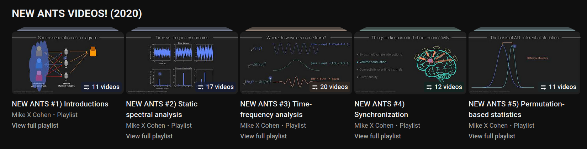

# Interesting Links :link: :earth_africa:
This document contains a commented list of links to internet resources that may be of interest to Brain Stimulation & Multimodal Electrophysiological Recording students. Those resources are not necessarily part of the course bibliography and are meant to nurture the students' personal interest beyond the exam.

The hands-on activity has treated TMS-EEG preprocessing using relatively advanced computational tools like modern Python libraries and Anaconda environments. In doing so, it has touched upon the topic of reproducibility and used several data analysis tool. Therefore, links are categorised accordingly. 

## Table of Contents

1. [EEG & TMS-EEG Analyses](#1-eeg--tms-eeg-analysis)
2. [Python, Anaconda, & Productivity Tools](#2-python-anaconda-and-productivity-tools)
3. [Reproducibility & Open Science Practices](#3-reproducibility--open-science-practices)
4. [Data Analysis Resources](#4-data-analysis-resources)

## 1. EEG & TMS-EEG Analysis
### 1.1. Papers on Methodological Issues in (TMS-)EEG Data Analysis
- [Pion-Tonachini et al. (2019)](https://www.sciencedirect.com/science/article/abs/pii/S1053811919304185?via%3Dihub) present an automatic classifier of independent components, with the aim of reducing between-raters variability. This work is particularly valuable because of its broad scope, which includes code (accessible through MNE-Python functions), labelled data, and a [supporting website](https://labeling.ucsd.edu/tutorial). This last resource can be particularly useful for students. because it contains [written directions on how to label components](https://labeling.ucsd.edu/tutorial/labels) and a [service to practice labelling](https://labeling.ucsd.edu/tutorial/practice), with a chance to see what others do
- [Bertazzoli et al. (2021)](https://www.sciencedirect.com/science/article/pii/S1053811921005486) show that using different preprocessing pipelines on the same TMS-EEG dataset yields significantly different results. [Botvinik-Nezer et al. (2020)](https://www.nature.com/articles/s41586-020-2314-9) had obtained similar results using fMRI data
- Results like the previous have nurtured the debate on the reproducibility of (TMS-)EEG data analysis and emphasised the urgency to define preprocessing standards. In this respect, the following articles may be of particular interest:
    - [Brancaccio et al. (2024)](https://www.sciencedirect.com/science/article/pii/S1053811924003719) extend on Bertazzoli et al.'s approach by comparing different pipelines on simulated data with a known ground-truth &mdash; thereby estimating not only the variability between pipelines, but also the ability of each pipeline to retrieve the ground truth (something that is usually not available in neuroimaging studies)
    - [Rogasch et al. (2022)](https://www.sciencedirect.com/science/article/abs/pii/S0165027022000218?via%3Dihub) discuss the challenges of TMS-EEG preprocessing and try to formulate a set of best practices. Interestingly, one of their suggestions is to use two or three different pipelines and take the between-pipelines variability when interpreting results 
    - [Hernandez-Pavon et al. (2023)](https://www.sciencedirect.com/science/article/pii/S1935861X23016960#sec6) take it one step further, providing a more thorough discussion of all the most relevant TMS-EEG methodological issues (including those pertaining to data collection)
    - [Trübutschek (2024)](https://direct.mit.edu/jocn/article/36/2/217/118308) introduce the EEGManyPipelines initiative, which involves hundreds of researchers across the globe analysing the same EEG dataset with their preferred strategies. This is expected to provide a thorough account of variability in preprocessing practices across the globe and a robust estimate of its impact on scientific conclusions
- [Delorme (2023)](https://www.nature.com/articles/s41598-023-27528-0) compared a set of pipelines on the same EEG dataset. His results show that sophisticated preprocessing strategies do not increase the percentage of channels showing statistically significant evoked potentials compared to applying high-pass filtering and bad channels interpolation only. This suggests that preprocessing might hide differences between conditions by inadvertently removing signal together with the noise
    - [de Cheveigné (2023)](https://www.biorxiv.org/content/10.1101/2023.06.19.545602v1.abstract) does not agree with Delorme, questioning the conclusion that "EEG is better left alone" and recommending case-by-case critical thinking

### 1.2. Papers on Methodological Issues in TMS-EEG Data Collection
The hands-on activity has focused on data preprocessing. However, data collection is just as critical in the construction of new scientific knowledge, for at least two reasons:

- The first reason is that preprocessing cannot make miracles, and particularly dirty data will require extensive preprocessing that might introduce unwanted variability. Therefore, it is important to collect clean data that will require minimum preprocessing
- The second reason is that some aspects of data collection might look like technical details, but they actually have a strong impact on the content of the data &mdash; and consequently, on the scientific conclusions that might be drawn from the data. In this respect, the following papers might be of special interest:
    - [Guidali et al. (2023)](https://onlinelibrary.wiley.com/doi/full/10.1111/ejn.16127) demonstrate that stimulation parameters like current direction and pulse waveform impact the amplitude, latency and replicability of TEPs 
    - [Lucarelli et al. (2025)](https://link.springer.com/article/10.1007/s10548-025-01113-2) find that variations of current direction and pulse waveform might actually activate different cortical pathways
    - [Stango et al. (2025)](https://www.sciencedirect.com/science/article/pii/S1053811925005294#bib0013) show that TMS pulse intensity and EEG sampling rate affect the shape of two typical TMS-EEG artifacts (the pulse and decay artifacts) 

Overall, articles like these show that data collection is not a one-size-fits-all process: the way we use the instruments matters.

## 2. Python, Anaconda, and Productivity Tools
### 2.1. Python
This hands-on activity was built around Python: a modern, open-source, free and highly readable programming language that is currently on the rise in the neuroscientific community and beyond. There are many reasons behind this choice, all detailed in a dedicated document ([Why Python?](./why-python.md)). Unfortunately, cognitive neuroscience students are usually not taught any Python, which is the reason why you were not asked to produce original code yourself during your hands-on activity. If you want to learn more about this language, you can attend the course [Introduction to Computer Programming (Python)](https://unitn.coursecatalogue.cineca.it/insegnamenti/2025/50802_649472_95796/2025/50802/10876?annoOrdinamento=2025&coorte=2025), taught by prof. Paolo Rota in the CLC track at CIMeC's master. Otherwise, the following links might serve as a reference for a less structured, lower-commitment learning path:

- [Python for (open) Neuroscience](https://github.com/vigji/python-cimec-2024), a course taught by Luigi Petrucco at CIMeC's doctoral school in spring 2024. There is also a more recent version of this course (2025) but it is less complete, so I would suggest you stick to the 2024 edition
- [Python for Neuroscience](https://pyforneuro.com/) is a website with a good collection of basic Python tutorials and a set of neuroscience use cases
- [Real Python](https://realpython.com/) is a great resource for delving deeper into specific topics, like [classes](https://realpython.com/python-classes/)

### 2.2. Anaconda
Anaconda is a key component of all Python-based workflows. There was not enough time to introduce it thoroughly during the hands-on activity, but there is not much more to it than what you experienced in class: Anaconda is a package manager &mdash; that is, software that orchestrates the interactions between other software. Its power lies in three features:

- Easy access to a wide variety of Python and R libraries
- Ability to easily create, manage, and share environments &mdash; that is, _"self-contained, isolated spaces where you can install specific versions of software , including dependencies, libraries, and Python versions. This isolation helps avoid conflicts between package versions and ensures that your projects have the exact libraries and tools they need"_ (source: Anaconda documentation &mdash; accessed December 2025) 

The [Anaconda documentation](https://www.anaconda.com/docs/main) contains everything there is to know about the product, including detailed step-by-step tutorials and concepts guides.

### 2.3. Productivity Tools
During the hands-on activity we used Jupyter Notebooks through their web-based interface &mdash; a quick-and-dirty solution to let you use the notebooks without introducing even more new tools. However, there are better ways to use notebooks and, in general, to code.

The best way to interact with notebooks and scripts is to use a modern code editor like [VSCode](https://code.visualstudio.com/), [PyCharm](https://www.jetbrains.com/pycharm/), or [Spyder](https://www.spyder-ide.org/). These are user-friendly interfaces between users and programming languages that can greatly facilitate data analysis workflows. I personally use VSCode and I think it is a great tool &mdash; especially because it has an integrated file manager, terminal, and Git interface.

## 3. Reproducibility & Open Science Practices
Over the last 20 years, reproducibility has become a hot topic in neuroscience and beyond, sparking interest for topics like _open science_, _open data_, and _open code_. The cause behind this interest was the publication of a series of impactful papers that provided quantitative assessments of the reproducibility of scientific results, finding that it was extremely poor &mdash; especially in so-called "soft" sciences like neuroscience and psychology. The list below provides pointers to the main papers of interest and to a few websites that might help you navigate the _open_ world. 

### 3.1. Essential Papers on the Reproducibility Crisis
- [Ioannidis (2005)](https://journals.plos.org/plosmedicine/article?id=10.1371/journal.pmed.0020124) opened the debate on the reproducibility of scientific results with this quantitatively-informed essay, whose provocative title says it all: _Why Most Published Research Findings Are False_. The author makes a critical analysis of the current version of the scientific methods and concludes that _"a research finding is less likely to be true when the studies conducted in a field are smaller; when effect sizes are smaller; when there is a greater number and lesser preselection of tested relationships; where there is greater flexibility in designs, definitions, outcomes, and analytical modes; when there is greater financial and other interest and prejudice; and when more teams are involved in a scientific field in chase of statistical significance"_
- [Vul et al. (2009)](https://journals.sagepub.com/doi/full/10.1111/j.1745-6924.2009.01125.x) argue that social and affective neuroscience are plagued by bad statistical practices that artificially increase correlations between fMRI metrics and behavioural scores, thereby increasing the false positive rate to unacceptable values
- Following papers like the previous, a wealth of studies have investigated the true size and latent causes of reproducibility failures in neuroscience and psychology. In this respect, the following papers are essential reads: [Simmons et al., 2011](https://journals.sagepub.com/doi/10.1177/0956797611417632), [Button et al., 2013](https://www.nature.com/articles/nrn3475), [Open Science Collaboration, 2015](https://www.science.org/doi/full/10.1126/science.aac4716), [Szucs & Ioannidis (2017)](https://journals.plos.org/plosbiology/article?id=10.1371/journal.pbio.2000797#references), [Munafò et al., (2017)](https://www.nature.com/articles/s41562-016-0021)

### 3.2. Glossaries, Open Books & Guides
The following internet resources might be useful to navigate the _open_ world and gain actionable insights:
- [Crüwell et al. (2019)](https://econtent.hogrefe.com/doi/full/10.1027/2151-2604/a000387) provide an annotated list of introductory open science readings 
- [Kathawalla et al. (2021)](https://online.ucpress.edu/collabra/article/7/1/18684/115927/Easing-Into-Open-Science-A-Guide-for-Graduate) provide a tutorial guide to core open science practices, aimed specifically at graduate students 
- [The Framework for Open and Reproducible Research Training (FORRT)](https://forrt.org/) curates a detailed [glossary of open science terms](https://forrt.org/glossary/vbeta/), which becomes much needed once you start delving deeper into open science
- [Experimentology](https://experimentology.io/) is a free book on experimental psychology methods, with an eye on open and reproducible practices
- [Better Code, Better Science](https://bettercodebetterscience.github.io/book/) is a free book on good programming practices by Russel Poldrack, a prominent exponent of the open science movement. The book encourages AI-assisted coding, but the principles it treats remain valid in the absence of AI use  

### 3.3. The Italian Reproducibility Network 
[The Italian Reproducibility Network (ITRN)](https://www.itrn.org/) is an association of Italian scientists that promote the use of open science practices through research and education

## 4. Data Analysis Resources
The following links point to learning resources for EEG data analysis and some prerequisite mathematics or coding skills. Some are more formal than others but they are all high-quality.

- Former neuroscience professor Mike X Cohen has an excellent [YouTube channel](https://www.youtube.com/@mikexcohen1/featured) where he uploads tutorials and short courses on EEG data analysis, mathematics, and data science. The New ANTS series is particularly useful as an introduction to EEG data and their analysis. Cohen is also the author of an excellent textbook, _Analyzing Neural Time Series Data_ (MIT Press), that largely overlaps with the ANTS video series
  
- If you are willing to understand EEG data analysis in detail, you will need a working understanding of linear algebra concepts. To this end, the introductory course [Essence of linear algebra](https://www.youtube.com/playlist?list=PLZHQObOWTQDPD3MizzM2xVFitgF8hE_ab) by Grant Sanderson (also known as [3Blue1Brown](https://www.3blue1brown.com/)) can be a very good start
- If you are particularly interested in the mechanics of time frequency analysis, you might enjoy [Seeing Circles, Sines, and Signals](https://jackschaedler.github.io/circles-sines-signals/) by Jack Schaedler. The examples are centered on sound waves, but the mathematics apply equally to electrophysiological waves

# Contacts

For questions, comments, or suggesting new entries: 

:question: Matteo De Matola ([UniTN](https://webapps.unitn.it/du/en/Persona/PER0247884/Curriculum), [GitHub](https://github.com/matteo-d-m))

:mailbox: matteo [dot] dematola [at] unitn [dot] it